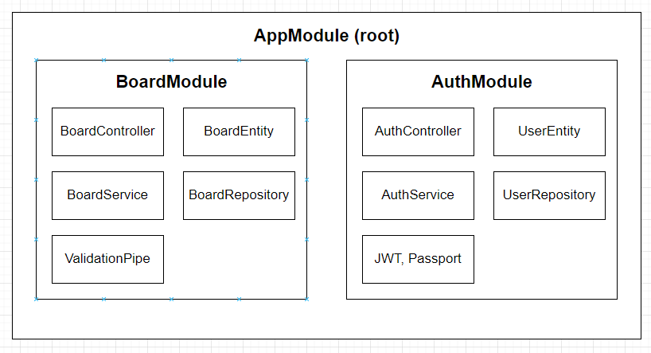
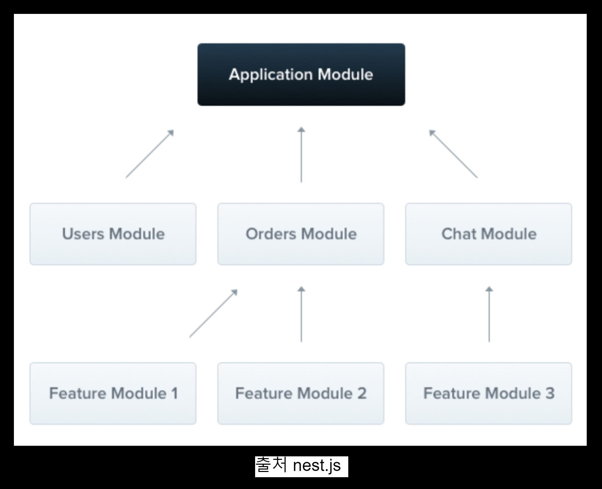
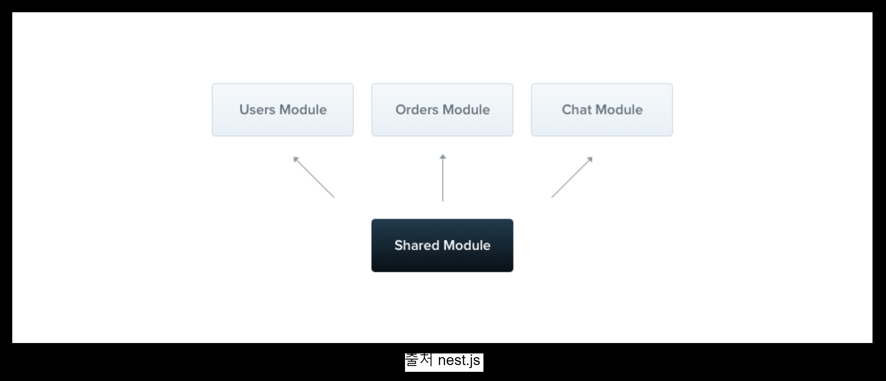
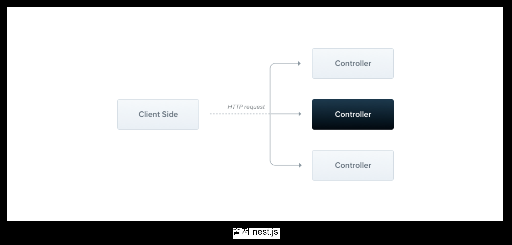
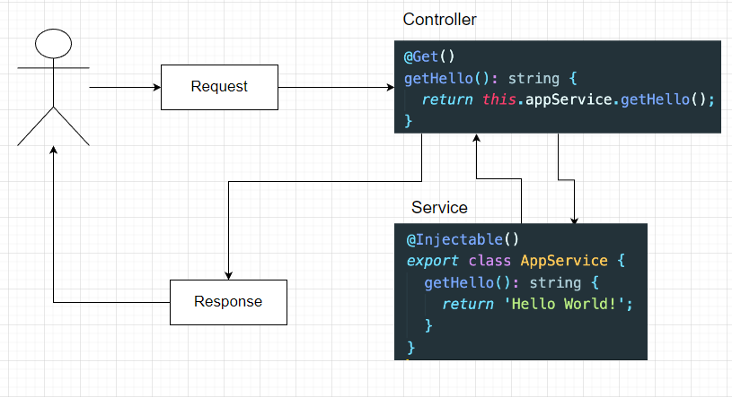
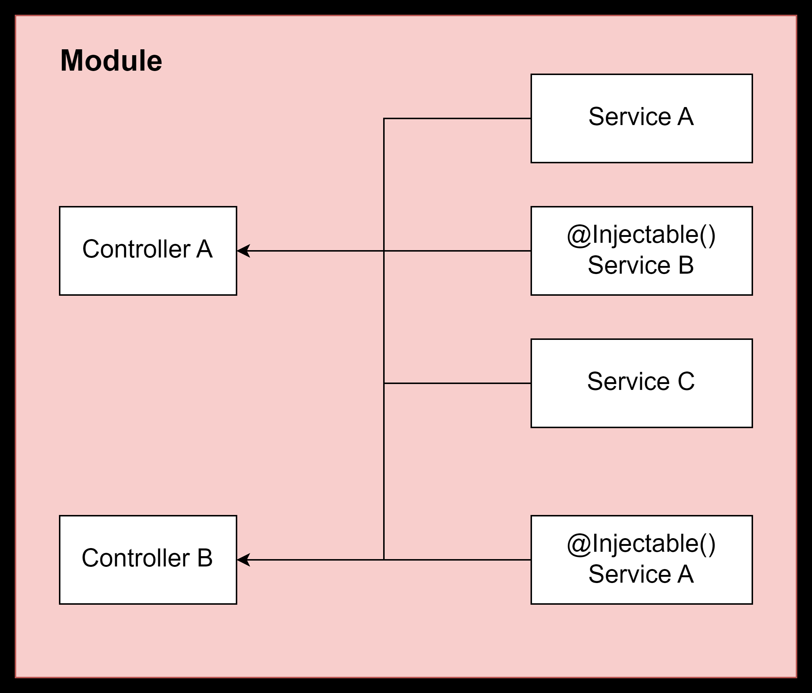
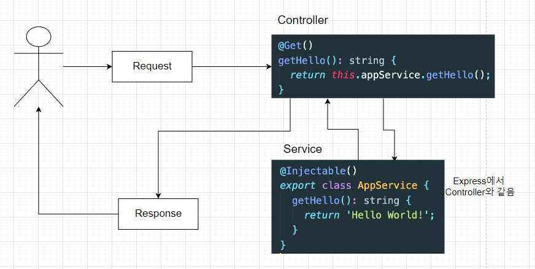
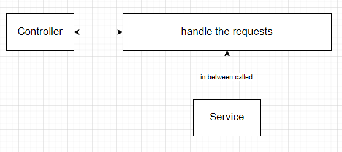
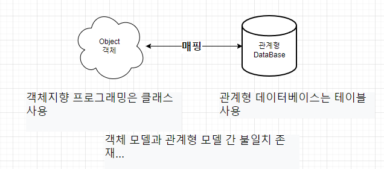

# Study to Nest JS 

## NestJS 란?

1. Nest는 효율적이고 확장 가능한 Node.js 서버 측 애플리케이션을 구축하기 위한 <strong>프레임 워크</strong>
1. <strong>Progressive Javascript</strong>를 사용하고 <strong>TypeScript</strong>로 빌드되고 완벽하게 지원함

## NestJS의 내부

1. 내부적으로 Nest는 Express(기본값)와 같은 강력한 <strong>HTTP 서버 프레임 워크</strong>를 사용하며 선택적으로 Fastify를 사용하도록 구성할 수 있다.
1. Nest는 이러한 공통 Node.js 프레임워크 (Express/Fastify) 위에 추상화 수준을 제공하지만 <strong>API 개발자에게 직접 노출</strong>함. 이를 통해 개발자는 기본 플랫폼에서 사용할 수 있는 수많은 타사 모듈을 자유롭게 사용 가능

## NestJS의 철학

1. Node를 위한 훌륭한 라이브러리, 도우미 및 도구가 많이 존재하지만 이들 중 어느 것도 아키텍처의 주요 문제를 효과적으로 해결하지 못함.
1. Nest는 개발자와 팀이 <strong>고도로 테스트 가능</strong>, 확장 가능하며 느슨하게 결합되고 유지 관리가 쉬운 애플리케이션을 만들 수 있는 <em>즉시 사용 가능한 애플리케이션 아키텍처를 제공</em>

## Start to Nest CLI

```bash
# Install Nest CLI
$ npm i -g @nestjs/cli    # nest cli install
$ nest new project-name   # create nest project
```

- 새 프로젝트 디렉터리 생성
- 초기 핵심 Nest 파일 및 지원 모듈로 디렉터리가 채워져 프로젝트의 기본 구조 생성

```bash
# Nest 설치 확인
$ nest --version  # check NestJS (설치 확인)
```

```bash
# Start Nest Server
$ npm run start:dev
```

## 기본 구조

- eslintrc.js : 개발자들이 특정한 규칙을 가지고 코드를 깔끔하게 짤 수 있게 도와주는 라이브러리. <strong>타입스크립트를 쓰는 가이드 라인 제시, 문법에 오류가 나면 알려주는 역할 등등 </strong>
- prettierrc : 주로 코드 형식을 맞추는데 사용합니다. 작은따옴표(')를 사용할지 큰 따옴표(")를 사용할지, Indent 값을 2로 줄지 4로 줄지등등, <strong>에러 찾는것이 아닌 코드 포맷터 역할.</strong>
- nest-cli.json : nest 프로젝트를 위해 특정한 설정을 할 수 있는 json 파일
- tsconfig.json : 어떻게 타입 스크립트를 컴파일 할지 설정
- tsconfig.build.json : tsconfig.json의 연장선 상의 파일이며, build를 할 때 필요한 설정들, "excludes" 에서는 빌드할 때 필요없는 파일들 명시
- package.json

    <em>build : 운영환경을 위한 빌드</em><br>
    <em>format : 린트에러가 났을지 수정</em><br>
    <em>start : 앱 시작</em>
- src 폴더(대부분의 비즈니스 로직이 들어가는 곳)

    <em>main.ts : 앱을 생성하고 실행</em><br>
    <em>app.module.ts : 앱 모듈을 정의</em><br>


## Module 



### NestJs 모듈이란?
- 모듈은 <span style='color:green; font-weight:bold'>@Module()</span> 데코레이터로 주석이 달린 클래스
- <span style='color:green; font-weight:bold'>@Module()</span> 데코레이터는 Nest가 애플리케이션 구조를 구성하는데 사용하는 메타 데이터를 제공

<em>각 응용프로그램에는 하나 이상의 모듈 (루트 모듈)이 있습니다. 루트 모듈은 Nest가 사용하는 시작점입니다.</em>


- 모듈은 밀접하게 관련된 기능 집합으로 구성 요소를 구성하는 효과적인 방법입니다.(기능별로 만듭니다) ex) 유저 모듈, 주문 모듈, 챗 모듈...

- 같은 기능에 해당하는 것들은 하나의 모듈 폴더안에 넣어서 사용합니다.  (UserController, UserService, UserEntity  다 같은 기능이기에 UserModule안에 넣습니다.)

- 모듈은 기본적으로 싱글 톤이므로 여러 모듈간에 쉽게 공급자의 동일한 인스턴스를 공유 할 수 있습니다.


<br>

### Nest 주의사항
- NestJs는 생성할 때 웬만하면 명령어로 모두 생성한다.

### Board Module 생성
```bash
# Board 모듈 생성 명령어
$ nest g module boards
# nest : nestcli를 사용한다.
# g : generate 생성한다
# module : module을 생성한다.
# boards : 생성할 모듈의 이름
```

### NestJS Controller란?
- 컨트롤러는 들어오는 요청을 처리하고 클라이언트에 응답을 반환합니다.



- 컨트롤러는 @Controller 데코레이터로 클래스를 데코레이션하여 정의된다.
```javascript
@Controller('/boards')
export class BoardsController{

}
```
- 데코레이터는 인자를 Controller에 의해서 처리되는 "경로"를 받습니다.

### Handler란?
- 핸들러는 @Get, @Post, @Delete 등과 같은 데코레이터로 장식된 컨트롤러 클래스 내의 단순한 메서드이다.

```javascript
@Controller('/boards')
export class BoardsController{

    @Get()
    getBoards(): string{
        return 'This is action retunrs all boards';
    }

}
```

### 컨트롤러 구조


### 컨트롤러 생성 명령어
```bash
$ nest g controller boards --no-spec
```

### Provider란?
- 프로바이더는 Nest의 기본 개념이다. 대부분 기본 Nest 클래스는 서비스, 레포지토리, 팩토리, 헬퍼 등 프로바이더로 취급될 수 있다. 프로바이더의 주요 아이디어는 <strong>종속성(DI)으로 주입</strong>할 수 있다는 것이다. 즉, 객체는 서로 다양한 관계를 만들 수 있으며 객체의 인스턴스를 <strong>"연결"</strong>하는 기능은 대부분 Nest 런타임 시스템에 위임될 수 있다.



### Servcie 란?
- 서비스는 소프트웨어 개발내의 공통 개념이며, NestJS, Javascript에서만 쓰이는 개념이 아닙니다.

- @Injectable 데코레이터로 감싸져서 모듈에 제공되며, 이 서비스 인스턴스는 애플리케이션 전체에서 사용 될 수 있다.

- 서비스는 컨트롤러에서 데이터의 <strong>유효성 체크</strong>를 하거나 <strong>데이터베이스에 아이템을 생성</strong>하는 등의 작업을 하는 부분을 처리합니다. 



### Board Service 만들기

```bash
$ nest g service boards --no-spec
```


## Servcie를 Controller에서 이용할 수 있는 방법 (Dependency Injection)
- 위에 보면 Contoller에서   this.appService.getHello(); 이런식으로  Service에 정의해놓은 메소드를 Controller에서 가져와서 쓰는 걸 볼 수 있습니다. 

```javascript
import { Controller, Get, Post, Body, Param, Delete, ... } from '@nestjs/common';
import { BoardsService } from './boards.servcie';
import { Board, BoardStatus } from './boards.model';
import { CreateBoardDto } from './dto/create-board.dto';
import { GetBoardsFilterDto } from './dto/get-boards-fill';

@Controller('boards')
export class BoardsController {
    constructor(private boardsService: BoardsService) {}

    @Get('/:id')
    getBoardById(@Param('id') id: string): Board {
        return this.boardsService.getBoardById(id);
    }
}
```
- 위에 보면 BoardsService를 Contructor 클래스에서 가져오고(Injected) 있습니다. 그런 후에 Private 문법을 사용하고 있습니다. 이렇게 해서 boardsService를 정의해서 Controller안에서 사용할수 있게 만들었습니다. 이렇게 할 수 있는 이유는 타입스크립트의 기능을 이용해서 종속성을 타입으로 해결할수 있기떄문입니다. 

#### 추가 내용 
```javascript
// 기존 사용법
@controller('boards')
export class BoardsController {
    boardsService: BoardsService;

    constructor(boardsService: BoardsService) {
        this.boardsService = boardsService;
    }
}
    
```
1. boardsService 파라미터에 BoardsService 객체를 타입으로 지정해줍니다. 
2. 이 boardsService 파라미터를 BoardsController 클래스 안에서 사용하기 위해서 this.boardsService  프로퍼티에  boardsService 파라미터를 할당해줍니다. 

3. 하지만 타입스크립트에서는 선언한 값만 객체의 프로퍼티로 사용가능하기 때문에 
위에 boardsService: BoardsService로 선언해줍니다.  

4. 이렇게 갖게된 boardsService 프로퍼티를 이용해서 BoardsController 클래스안에서 활용을 할수가 있습니다. 

<br>

### Provider 등록하기
- Provider를 사용하기 위해서는 이것을 Nest에 등록해야 사용 가능하다.
- 등록하기 위해서는 module 파일에서 할 수 있다. module 파일에 providers 항목안에 해당 모듈을 사용하고자 하는 Provider를 넣어주면 된다.

```javascript
import { Module } from '@nestjs/common';
import { BoardsModule } from './boards/boards.module';
import { BoardsService } from './boards/boards.service';

@Module({
  imports: [BoardsModule],
  providers: [BoardsService]
})
export class BoardsModule {}
```

### Handler Get()


#### 정리
- 클라이언트에서 요청을 보내면 먼저 컨트롤러로 가며 컨트롤러에서 알맞은 요청 경로에 
라우팅해서 해당 핸들러로 가게 해줍니다.

- 그런 후에 요청을 처리해주기 위해서 서비스로 들어가며 그 요청에 맞는 로직을 서비스에서 처리해준 후 컨트롤러에 리턴값을 보내준후 컨트롤러에서 클라이언트로 결과값을 보내줍니다. 

- 그래서 컨트롤러에서는 요청을 처리하고 결과값을 리턴해주는 역할을 합니다. 

### Board Model 정의하기

#### Interface와 Class의 차이


### 타입을 정의해주면 좋은 이유
- 타입 정의해주는 것은 선택사항입니다. 
- 하지만 이렇게 타입을 정의해주므로서 원하는 타입과 다른 코드를 사용할 시 에러가 발생합니다. 
- 그리고 코드를 읽는 입장에서 더 코드를 쉽게 이해하며 읽을 수 있습니다. (readable)

### DTO (Data Transfer Object)란?
- 계층간 데이터 교환을 위한 객체입니다.
- DB에서 데이터를 얻어 Service나 Controller 등으로 보낼 때 사용하는 객체를 말합니다.

- DTO는 데이터가 네트워크를 통해 전송되는 방법을 정의하는 객체입니다.

- interface나 class를 이용해서 정의 될 수 있습니다. (하지만 클래스를 이용하는것을 Nest JS에서는 추천하고 있습니다)

### DTO를 쓰는 이유?
- 데이터 유효성 체크에 효율적이다.
- 더 안정적인 코드를 만들어준다. 

### Interface VS Class For DTO
- DTO는 Interface나 Class를 사용해서 만든다. 그러나 Class가 더 선호된다 그 이유는?

- TypeScript 인터페이스를 사용하거나 간단한 클래스를 사용하여 DTO 스키마를 결정할 수 있습니다. 흥미롭게도 여기에서 Class를 사용하는 것이 좋습니다. 왜? 클래스는 JavaScript ES6 표준의 일부이므로 컴파일 된 JavaScript에서 실제 엔티티로 유지됩니다. 반면에 TypeScript 인터페이스는 트랜스 파일 중에 제거되므로 Nest는 런타임에서 참조 할 수 없습니다.
이것은 파이프와 같은 기능을 런타임에서 사용할 수 있기 때문에  런타임에서 사용될 수 있는게 중요합니다. 그래서 DTO는 CLASS를 이용해서 만들겠습니다. 

### Pipe란?
- 파이프는 @Injectable() 데코레이터로 주석이 달린 클래스입니다. 
- 파이프는 data transformation<strong>[변형]</strong>과 data validation<strong>[유효성]</strong>을 위해서 사용 됩니다.
- 파이프는 컨트롤러 경로 처리기에 의해 처리되는 인수에 대해 작동합니다. 

- Nest는 메소드가 호출되기 직전에 파이프를 삽입하고 파이프는 메소드로 향하는 인수를 수신하고 이에 대해 작동합니다.

#### Data Transformation
- 입력 데이터를 원하는 형식으로 변환 (예 : 문자열에서 정수로)
만약 숫자를 받길 원하는데 문자열 형식으로 온다면 파이프에서 자동으로 숫자로 바꿔줍니다.
String to Integer       EX)  string  '7'  =>  Integer   7

#### Data Validation
- 입력 데이터를 평가하고 유효한 경우 변경되지 않은 상태로 전달하면됩니다. 그렇지 않으면 데이터가 올바르지 않을 때 예외를 발생시킵니다.
만약 이름의 길이가 10자 이하여야 하는데 10자 이상 되면 에러를 발생시킵니다.

### Pipe 사용 방법(Binding Pipes)
- 파이프를 사용하는 방법(Binding pipes)은 세가지로 나눠질수 있습니다.

<em>Handler-level Pipes ,Parameter-level Pipes, Global-level Pipes</em> 입니다
이름에서 말하는 것 그대로  핸들러 레벨, 파라미터 레벨, 글로벌 레벨로 파이프 사용할 수 있습니다

#### Handler-level Pipes
- 핸들러 레벨에서 @UsePipes() 데코레이터를 이용해서 사용 할 수 있습니다.
이 파이프는 모든 파라미터에 적용이 됩니다. (title, description)

#### Parameter-level Pipes
- 파라미터 레벨의 파이프 이기에 특정한 파라미터에게만 적용이 되는 파이프 입니다.
아래와 같은 경우에는 title만 파라미터 파이브가 적용이 됩니다.

#### Global Pipes
- 글로벌 파이프로서 애플리케이션 레벨의 파이브 입니다. 클라이언트에서 들어오는 모든 요청에 적용이 됩니다. 가장 상단 영역인 main.ts에 넣어주시면 됩니다.

### Built-in Pipes
- Nest JS 에 기본적으로 사용할 수 있게 만들어 놓은 6가지의 파이프가 있습니다.

- ValidationPipe
- ParseIntPipe
- ParseBoolPipe
- ParseArrayPipe
- ParseUUIDPipe
- DefaultValuePipe

## 파이프 유효성 체크 

### 필요한 모듈
- class-validator 
- class-transformer 

```bash
npm install class-validator class-transformer --save
```
[Docs](https://github.com/typestack/class-validator#manual-validation)
<hr>

### 커스텀 파이프 구현 방법
- 먼저 PipeTransform이란 인터페이스를 새롭게 만들 커스텀 파이프에 구현해줘야 합니다.
- 이 PipeTransform 인터페이스는 모든 파이프에서 구현해줘야 하는 인터페이스입니다.
- 그리고 이것과 함께 모든 파이프는 transform() 메소드를 필요합니다. 
- 이 메소드는 NestJS가 인자(arguments)를 처리하기 위해서 사용됩니다.

## TypeORM
- TypeORM은 node.js에서 실행되고 TypeScript로 작성된 객체 관계형
매퍼 라이브러리입니다.

- TypeORM은 MySQL, PostgreSQL, MariaDB, SQLite, MS SQL Server, Oracle, SAP Hana 및 WebSQL과 같은 여러 데이터베이스를 지원합니다. 

### ORM(Object Relational Mapping) 이란?
- 객체와 관계형 데이터베이스의 데이터를 자동으로 변형 및 연결하는 작업입니다.

- ORM을 이용한 개발은 객체와 데이터베이스의 변형에 유연하게 사용할 수 있습니다.



### TypeORM vs Pure Javascript
```javascript
// TypeORM
const boards = Board.find({ title: 'Hello' , status: 'PUBLIC' });

// Pure Javascript
db.query('SELECT * FROM boards WHERE title = "Hello" AND status = "PUBLIC" , (err, result) => {
    if(err) {
        throw new Error('Error');
    }
    boards = result.rows;
});
```

### TypeORM 특징과 이점
<hr>
- 모델을 기반으로 데이터베이스 테이블 체계를 <em>자동</em>으로 생성합니다.
- 데이터베이스에서 개체를 쉽게 삽입, 업데이트 및 삭제할 수 있습니다.
- 테이블 간의 매핑 (일대일, 일대 다 및 다 대다)을 만듭니다.
- 간단한 CLI 명령을 제공합니다.

- TypeORM은 간단한 코딩으로 ORM 프레임 워크를 사용하기 쉽습니다. 
- TypeORM은 다른 모듈과 쉽게 통합됩니다.
<br>

### TypeORM 설치 모듈
<hr>
@nestjs/typeorm
- NestJS에서 TypeORM을 사용하기 위해 연동시켜주는 모듈

typeorm
- TypeORM 모듈

pg 
- Postgres 모듈

```bash
# 모듈 설치
npm install pg typeorm @nestjs/typeorm --save
```
[Docs](https://docs.nestjs.com/techniques/database)

### 게시물을 위한 Entity 생성
왜 Entity를 생성해야하나요? 
원래 ORM 없이 데이터베이스 테이블을 생성할 때를 먼저 보겠습니다. 

```sql
CREATE TABLE board ( 
   id     INTEGER AUTO_INCREMENT PRIMARY KEY. 
   title  VARCHAR(255)  NOT NULL,
   decsription VARCHAR(255) NOT NULL  
)
```

이런 식으로 테이블을 생성해줍니다. 하지만 TypeORM을 사용할 떄는 
데이터베이스 테이블로 변환 되는 Class이기 때문에 위에 처럼하지 않고 
클래스를 생성한 후 그 안에 컬럼들을 정의해주시면 됩니다. 

### @Entity()
- Entity () 데코레이터 클래스는 Board 클래스가 엔티티임을 나타내는 데 사용됩니다.     CREATE TABLE board 부분입니다. 

### @PrimaryGeneratedColumn()   <!--PRK -->
- PrimaryGeneratedColumn () 데코레이터 클래스는 id 열이 Board 엔터티의 기본 키 열임을 나타내는 데 사용됩니다.

### @Column()
- Column () 데코레이터 클래스는 Board 엔터티의 title 및 description과 같은 다른 열을 나타내는 데 사용됩니다.

### Repository란?
- 리포지토리는 엔터티 개체와 함께 작동하며 엔티티 찾기, 삽입, 업데이트, 삭제 등을 처리합니다.
공식 문서 주소

[Docs](http://typeorm.delightful.studio/classes/_repository_repository_.repository.html)
